# Entity Relationship Diagram

## Table of Contents

1. [Overview](#overview)
2. [Core Domain ERD](#core-domain-erd)
3. [Users Module](#users-module)
4. [Products Module](#products-module)
5. [Inventory Module](#inventory-module)
6. [Orders Module](#orders-module)
7. [Payments Module](#payments-module)
8. [Wallet Module](#wallet-module)
9. [Cart Module](#cart-module)
10. [Shipping Module](#shipping-module)
11. [Reviews Module](#reviews-module)
12. [Promotions Module](#promotions-module)
13. [Notifications Module](#notifications-module)
14. [Media Module](#media-module)
15. [CMS Module](#cms-module)
16. [Analytics Module](#analytics-module)
17. [Entity Summary](#entity-summary)

---

## 1. Overview

All entities use **UUID v4** primary keys and include `created_at` and `updated_at` timestamps. The database uses **schema-per-module** isolation in PostgreSQL. Foreign key references across module boundaries are UUID-based without enforced FK constraints to maintain module independence.

**Conventions:**
- `PK` = Primary Key (UUID v4)
- `FK` = Foreign Key
- `UK` = Unique Key
- `IDX` = Indexed
- All monetary values stored as `BIGINT` in Rials (IRR)
- Soft deletes via `deleted_at` timestamp where applicable

---

## 2. Core Domain ERD

This diagram shows the high-level relationships between the primary entities across all modules.

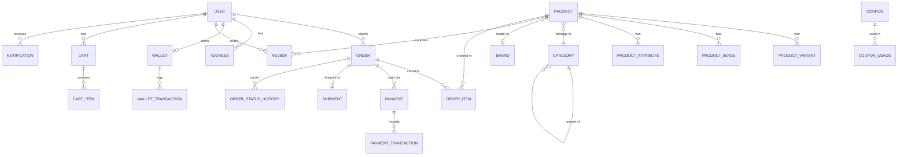

---

## 3. Users Module

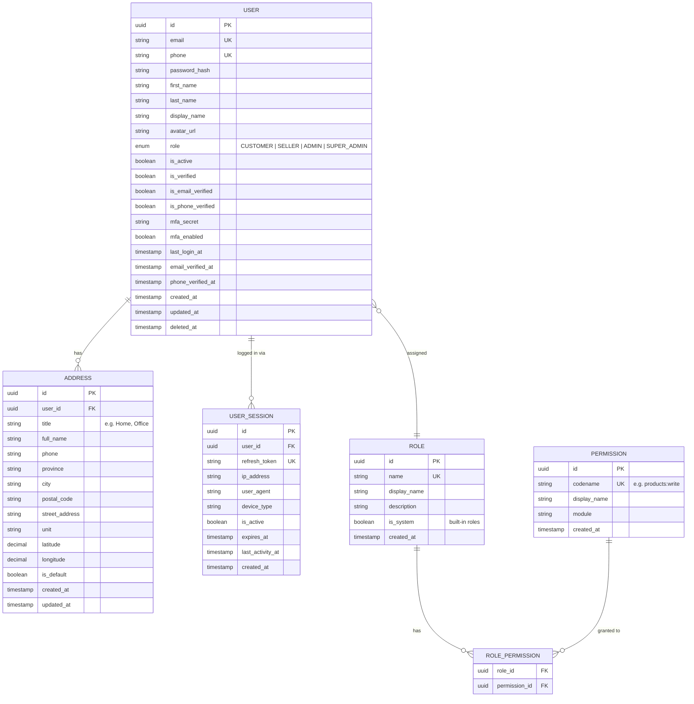

---

## 4. Products Module

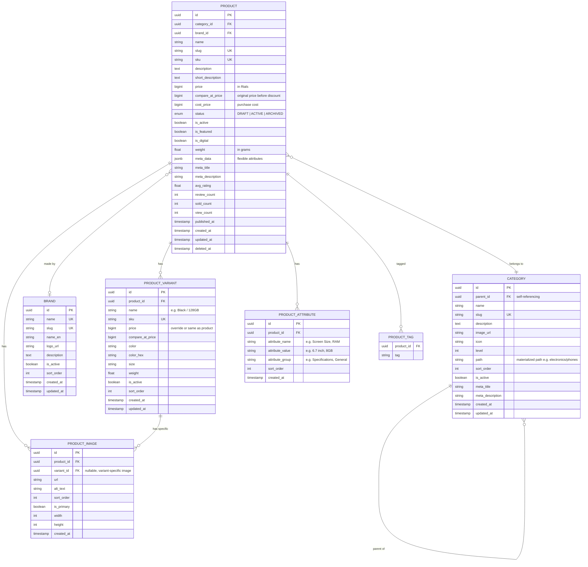

---

## 5. Inventory Module

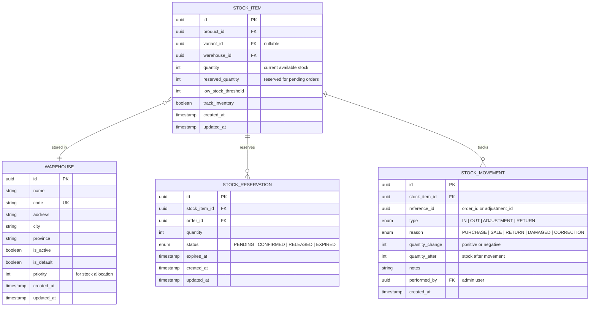

---

## 6. Orders Module

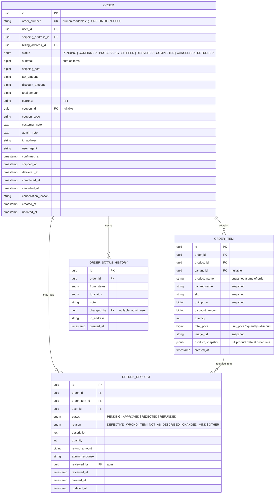

---

## 7. Payments Module

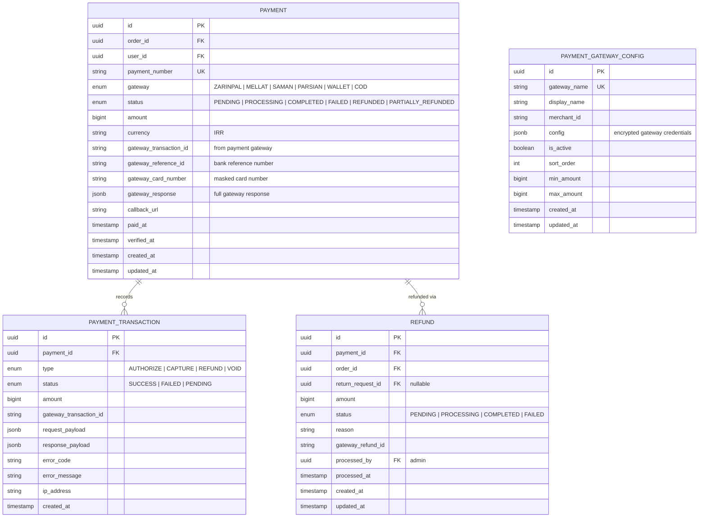

---

## 8. Wallet Module

```mermaid
erDiagram
    WALLET {
        uuid id PK
        uuid user_id FK UK
        bigint balance "current balance in Rials"
        bigint total_credited "lifetime credits"
        bigint total_debited "lifetime debits"
        boolean is_active
        timestamp created_at
        timestamp updated_at
    }

    WALLET_TRANSACTION {
        uuid id PK
        uuid wallet_id FK
        enum type "CREDIT | DEBIT"
        enum source "DEPOSIT | CASHBACK | REFUND | PURCHASE | WITHDRAWAL | ADMIN_ADJUSTMENT | TRANSFER_IN | TRANSFER_OUT"
        bigint amount
        bigint balance_after "wallet balance after transaction"
        uuid reference_id "order_id, refund_id, etc."
        string reference_type "ORDER | REFUND | TRANSFER | ADMIN"
        string description
        uuid performed_by FK "nullable, admin for adjustments"
        timestamp created_at
    }

    WALLET_TRANSFER {
        uuid id PK
        uuid from_wallet_id FK
        uuid to_wallet_id FK
        bigint amount
        string description
        enum status "COMPLETED | REVERSED"
        uuid from_transaction_id FK
        uuid to_transaction_id FK
        timestamp created_at
    }

    WALLET ||--o{ WALLET_TRANSACTION : logs
    WALLET ||--o{ WALLET_TRANSFER : "sent from"
    WALLET ||--o{ WALLET_TRANSFER : "received to"
```

---

## 9. Cart Module

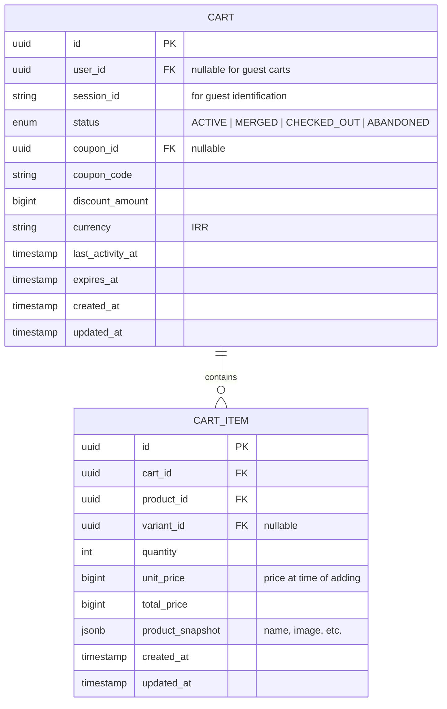

---

## 10. Shipping Module

```mermaid
erDiagram
    SHIPPING_METHOD {
        uuid id PK
        string name "e.g. Post, Tipax, Express"
        string code UK
        string provider "integration provider"
        text description
        boolean is_active
        int sort_order
        bigint base_cost
        int estimated_days_min
        int estimated_days_max
        boolean is_free_eligible "can be free with conditions"
        bigint free_shipping_threshold "minimum order for free shipping"
        timestamp created_at
        timestamp updated_at
    }

    SHIPPING_ZONE {
        uuid id PK
        string name
        string code UK
        jsonb provinces "list of province codes"
        boolean is_active
        timestamp created_at
        timestamp updated_at
    }

    SHIPPING_RATE {
        uuid id PK
        uuid shipping_method_id FK
        uuid shipping_zone_id FK
        float min_weight "grams"
        float max_weight "grams"
        bigint rate "cost in Rials"
        timestamp created_at
        timestamp updated_at
    }

    SHIPMENT {
        uuid id PK
        uuid order_id FK UK
        uuid shipping_method_id FK
        string tracking_number
        string tracking_url
        enum status "PENDING | PICKED_UP | IN_TRANSIT | OUT_FOR_DELIVERY | DELIVERED | RETURNED | FAILED"
        bigint shipping_cost
        float total_weight
        string carrier_name
        string carrier_reference
        timestamp estimated_delivery_at
        timestamp shipped_at
        timestamp delivered_at
        timestamp created_at
        timestamp updated_at
    }

    SHIPMENT_TRACKING_EVENT {
        uuid id PK
        uuid shipment_id FK
        enum status
        string location
        string description
        timestamp occurred_at
        timestamp created_at
    }

    SHIPPING_METHOD ||--o{ SHIPPING_RATE : "priced by"
    SHIPPING_ZONE ||--o{ SHIPPING_RATE : "applies to"
    SHIPMENT ||--o{ SHIPMENT_TRACKING_EVENT : tracks
    SHIPPING_METHOD ||--o{ SHIPMENT : "fulfilled via"
```

---

## 11. Reviews Module

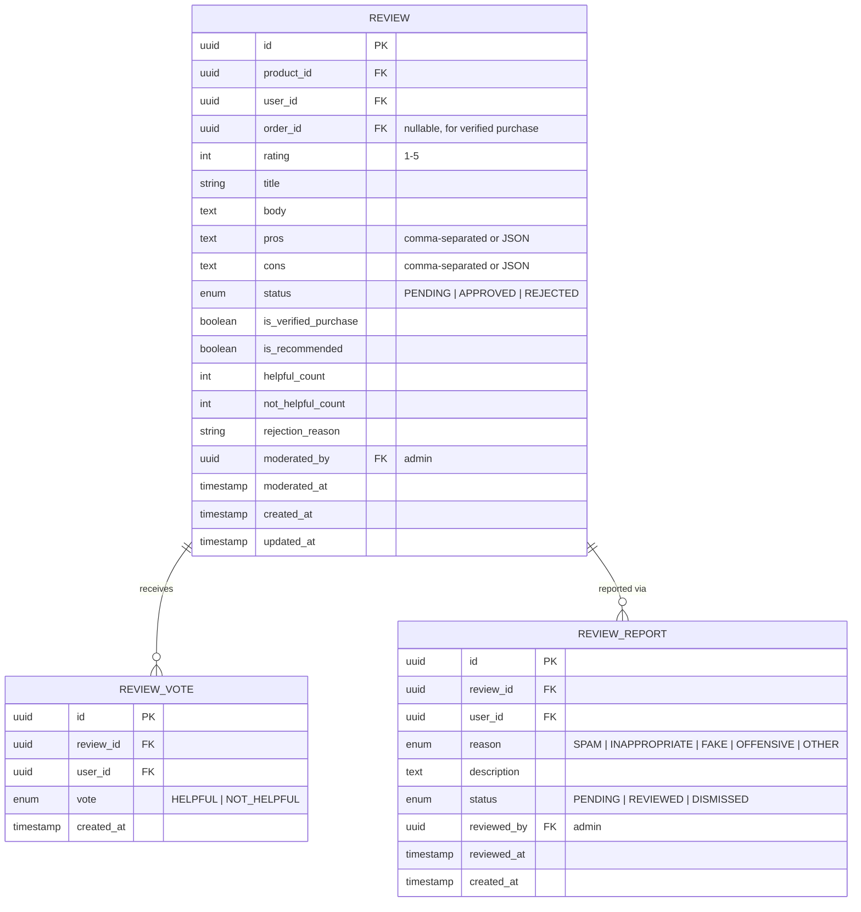

---

## 12. Promotions Module

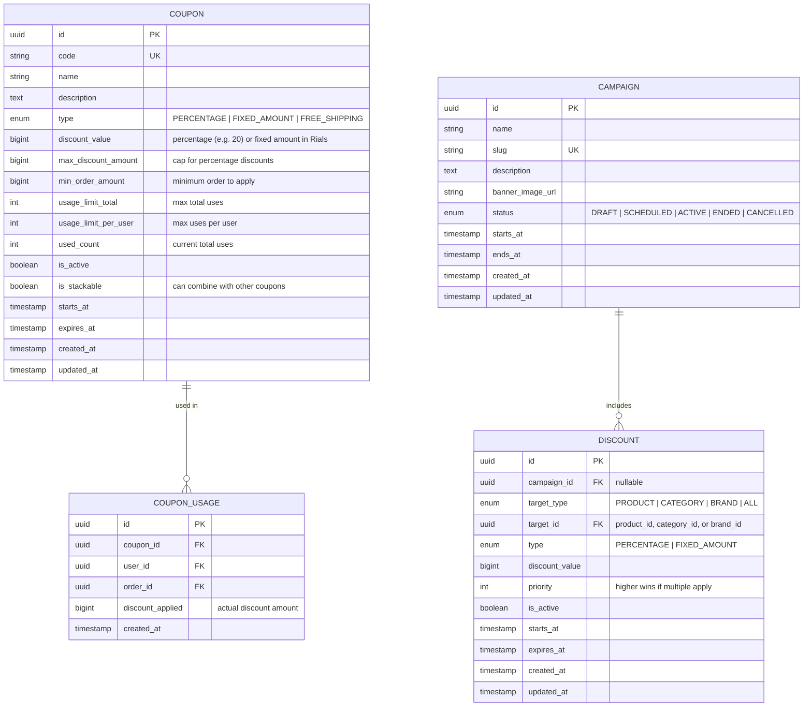

---

## 13. Notifications Module

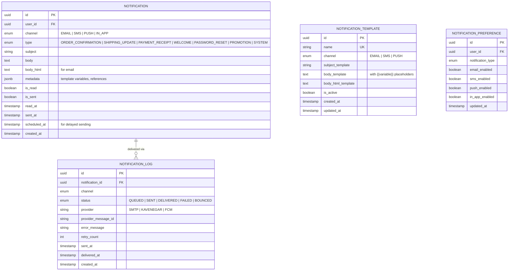

---

## 14. Media Module

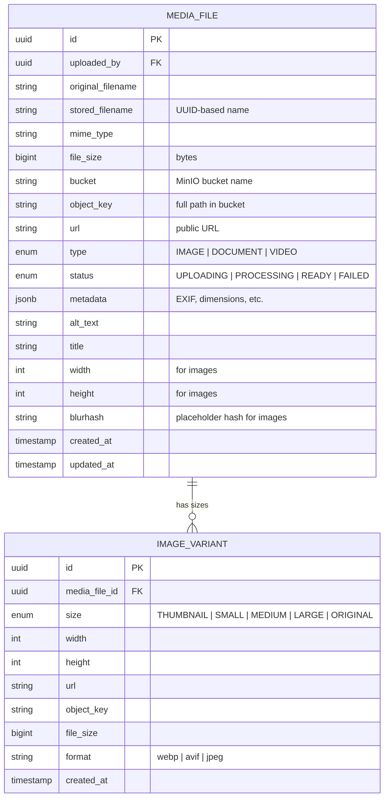

---

## 15. CMS Module

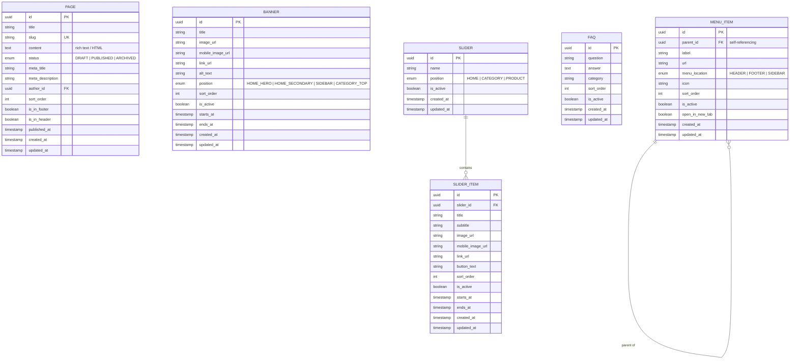

---

## 16. Analytics Module

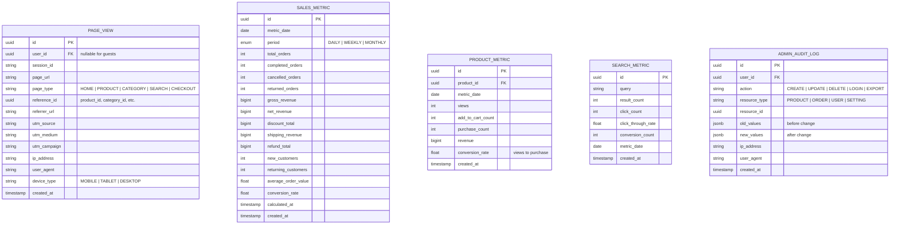

---

## 17. Entity Summary

| Module          | Entity                    | Table Name                    | Description                              |
|-----------------|---------------------------|-------------------------------|------------------------------------------|
| **Users**       | User                      | `users.users`                 | Platform users (customers, admins)       |
|                 | Address                   | `users.addresses`             | User delivery/billing addresses          |
|                 | UserSession               | `users.user_sessions`         | Active login sessions                    |
|                 | Role                      | `users.roles`                 | System roles                             |
|                 | Permission                | `users.permissions`           | Granular permissions                     |
|                 | RolePermission            | `users.role_permissions`      | Role-permission mapping                  |
| **Products**    | Product                   | `products.products`           | Product catalog entries                  |
|                 | Category                  | `products.categories`         | Hierarchical product categories          |
|                 | Brand                     | `products.brands`             | Product brands/manufacturers             |
|                 | ProductVariant            | `products.product_variants`   | Size/color/storage variants              |
|                 | ProductImage              | `products.product_images`     | Product photo gallery                    |
|                 | ProductAttribute          | `products.product_attributes` | Dynamic product specifications           |
|                 | ProductTag                | `products.product_tags`       | Searchable tags                          |
| **Inventory**   | StockItem                 | `inventory.stock_items`       | Stock levels per product/warehouse       |
|                 | StockReservation          | `inventory.stock_reservations`| Temporary stock holds                    |
|                 | StockMovement             | `inventory.stock_movements`   | Stock change audit trail                 |
|                 | Warehouse                 | `inventory.warehouses`        | Physical warehouse locations             |
| **Orders**      | Order                     | `orders.orders`               | Customer orders                          |
|                 | OrderItem                 | `orders.order_items`          | Individual items in an order             |
|                 | OrderStatusHistory        | `orders.order_status_history` | Order state change log                   |
|                 | ReturnRequest             | `orders.return_requests`      | Product return/refund requests           |
| **Payments**    | Payment                   | `payments.payments`           | Payment records                          |
|                 | PaymentTransaction        | `payments.payment_transactions`| Gateway transaction log                 |
|                 | PaymentGatewayConfig      | `payments.gateway_configs`    | Payment gateway settings                 |
|                 | Refund                    | `payments.refunds`            | Refund records                           |
| **Wallet**      | Wallet                    | `wallet.wallets`              | User digital wallets                     |
|                 | WalletTransaction         | `wallet.wallet_transactions`  | Wallet credit/debit log                  |
|                 | WalletTransfer            | `wallet.wallet_transfers`     | Wallet-to-wallet transfers               |
| **Cart**        | Cart                      | `cart.carts`                  | Shopping carts                           |
|                 | CartItem                  | `cart.cart_items`              | Items in shopping carts                  |
| **Shipping**    | ShippingMethod            | `shipping.shipping_methods`   | Available shipping providers             |
|                 | ShippingZone              | `shipping.shipping_zones`     | Geographic shipping zones                |
|                 | ShippingRate              | `shipping.shipping_rates`     | Zone/weight-based pricing                |
|                 | Shipment                  | `shipping.shipments`          | Order shipment records                   |
|                 | ShipmentTrackingEvent     | `shipping.tracking_events`    | Shipment status updates                  |
| **Reviews**     | Review                    | `reviews.reviews`             | Product reviews and ratings              |
|                 | ReviewVote                | `reviews.review_votes`        | Helpful/not helpful votes                |
|                 | ReviewReport              | `reviews.review_reports`      | Flagged review reports                   |
| **Promotions**  | Coupon                    | `promotions.coupons`          | Discount coupon codes                    |
|                 | CouponUsage               | `promotions.coupon_usages`    | Coupon redemption records                |
|                 | Discount                  | `promotions.discounts`        | Automatic discount rules                 |
|                 | Campaign                  | `promotions.campaigns`        | Marketing campaigns                      |
| **Notifications**| Notification             | `notifications.notifications` | User notifications                       |
|                 | NotificationTemplate      | `notifications.templates`     | Message templates                        |
|                 | NotificationPreference    | `notifications.preferences`   | User channel preferences                 |
|                 | NotificationLog           | `notifications.logs`          | Delivery status tracking                 |
| **Media**       | MediaFile                 | `media.media_files`           | Uploaded files metadata                  |
|                 | ImageVariant              | `media.image_variants`        | Resized image versions                   |
| **CMS**         | Page                      | `cms.pages`                   | Static content pages                     |
|                 | Banner                    | `cms.banners`                 | Promotional banners                      |
|                 | MenuItem                  | `cms.menu_items`              | Navigation menu entries                  |
|                 | FAQ                       | `cms.faqs`                    | Frequently asked questions               |
|                 | Slider                    | `cms.sliders`                 | Image slider/carousel groups             |
|                 | SliderItem                | `cms.slider_items`            | Individual slider slides                 |
| **Analytics**   | PageView                  | `analytics.page_views`        | Page visit tracking                      |
|                 | SalesMetric               | `analytics.sales_metrics`     | Aggregated sales data                    |
|                 | ProductMetric             | `analytics.product_metrics`   | Per-product performance data             |
|                 | SearchMetric              | `analytics.search_metrics`    | Search query analytics                   |
|                 | AdminAuditLog             | `analytics.admin_audit_logs`  | Admin action audit trail                 |

**Total Entities:** 52

---

*For related documentation, see:*
- *[System Architecture](./system.md)*
- *[Backend Architecture](./backend.md)*
- *[Frontend Architecture](./frontend.md)*
- *[Search Architecture](./search.md)*
