# MASTER IMPLEMENTATION PROMPT

## Enterprise-Grade Iranian Headless E-Commerce Platform

### Modular Monolith — Production-Ready — 100 → 100,000+ Users

---

## 0. نقش تو

تو در این پروژه هم‌زمان در نقش‌های زیر فعالیت می‌کنی:

* Principal Software Architect
* Senior Backend Engineer
* Senior Frontend Engineer
* Senior Database Architect
* Senior Application Security Engineer
* Senior DevOps / SRE Engineer
* Senior Product Engineer
* Code Reviewer
* Technical Lead

هدف تو فقط تولید کد نیست.

هدف تو ساخت یک **Enterprise-grade, maintainable, secure, scalable, production-ready e-commerce platform** است.

قبل از هر implementation باید معماری، وابستگی‌ها، trade-offها و ریسک‌های فنی را بررسی کنی.

---

# 1. قانون طلایی پروژه

این پروژه باید:

* Modular Monolith باشد.
* Microservice نشود.
* Headless Commerce باشد.
* API-first باشد.
* Backend و Frontend مستقل باشند.
* Domain logic داخل API routeها قرار نگیرد.
* Business logic داخل ORM modelها پراکنده نشود.
* Integration با سرویس‌های خارجی از Domain جدا باشد.
* قابلیت scale از 100 تا 100,000+ کاربر داشته باشد.
* امنیت از ابتدا در معماری لحاظ شود.
* Testability در تمام لایه‌ها وجود داشته باشد.
* Observability از ابتدا وجود داشته باشد.
* تمام تصمیمات معماری مستند شوند.

---

# 2. قبل از شروع کدنویسی

قبل از نوشتن حتی یک feature:

1. Repository را کامل inspect کن.
2. فایل‌ها و ساختار فعلی را بررسی کن.
3. package managerها و versionهای فعلی را بررسی کن.
4. نسخه‌های فعلی dependencyها را verify کن.
5. README و documentation موجود را بخوان.
6. فایل‌های Docker و CI/CD موجود را بررسی کن.
7. migrationها را بررسی کن.
8. configuration و environmentها را بررسی کن.
9. تست‌های موجود را اجرا کن.
10. مشکلات architecture موجود را ثبت کن.

سپس یک گزارش تحت عنوان:

`docs/ARCHITECTURE_AUDIT.md`

ایجاد کن.

در این فایل این موارد را بنویس:

* Current architecture
* Current dependencies
* Technical debt
* Security risks
* Performance risks
* Data-model problems
* Missing tests
* Deployment risks
* Scalability risks
* پیشنهاد اصلاحات

---

# 3. اصل عدم تغییر خودسرانه

این قرارداد معماری را بدون دلیل تغییر نده.

اگر به این نتیجه رسیدی که یک تکنولوژی باید تغییر کند:

1. دلیل را مستند کن.
2. trade-off را بنویس.
3. alternativeها را بررسی کن.
4. migration impact را بررسی کن.
5. سپس تصمیم را در:

`docs/adr/`

ثبت کن.

هیچ architecture decision مهمی نباید undocumented باشد.

---

# 4. Tech Stack

## Backend

Python

Framework:

**FastAPI**

ORM:

**SQLAlchemy 2.x**

Validation:

**Pydantic v2**

Database:

**PostgreSQL**

Migrations:

**Alembic**

Background jobs:

**Celery**

Broker / Cache:

**Redis**

HTTP client:

**httpx**

---

## Frontend

Next.js

App Router

TypeScript

React

Tailwind CSS

shadcn/ui

Radix UI

TanStack Query

Zustand

React Hook Form

Zod

Framer Motion

next-intl

---

## Search

**Elasticsearch**

---

## Storage

S3-compatible object storage.

Local development:

MinIO

Production:

S3-compatible storage / MinIO cluster / provider-equivalent.

---

## Infrastructure

Docker

Docker Compose

Nginx

Ubuntu 22.04 / 24.04

Let's Encrypt

GitHub Actions

---

## Observability

Sentry

Prometheus

Grafana

Structured JSON logging

OpenTelemetry-compatible tracing architecture

---

# 5. High-Level Architecture

Architecture باید مطابق این ساختار باشد:

```text
                         Internet
                            |
                            v
                     Cloudflare / CDN
                            |
                            v
                         Nginx
                      /          \
                     /            \
                    v              v
              Next.js             API
              Frontend          FastAPI
                  |                |
                  |                |
                  +-------+--------+
                          |
                    REST / JSON API
                          |
                          v
                 +-------------------+
                 |  FastAPI Backend  |
                 +-------------------+
                          |
        +-----------------+-------------------+
        |                 |                   |
        v                 v                   v
     Domain           Application        Infrastructure
     Modules             Services            Adapters
        |                   |                   |
        +-------------------+-------------------+
                            |
            +---------------+----------------+
            |               |                |
            v               v                v
        PostgreSQL        Redis         Elasticsearch
            |               |
            |               +--------------------+
            |                                    |
            v                                    v
          Data                              Celery
                                             |
                                  +----------+----------+
                                  |          |          |
                                  v          v          v
                               Email      SMS       Notifications
                                  |
                                  v
                         External Integrations

Additional:
MinIO/S3
Payment gateways
Shipping providers
SMS providers
Email provider
Telegram
n8n
Analytics
Monitoring
```

---

# 6. Architectural Style

از:

## Modular Monolith + Clean Architecture principles

استفاده کن.

ساختار dependency:

```text
Presentation
     |
     v
Application
     |
     v
Domain
     ^
     |
Infrastructure
```

قانون:

Domain نباید به:

* FastAPI
* SQLAlchemy
* Redis
* Elasticsearch
* Celery
* external APIs

وابسته باشد.

Infrastructure باید implementation جزئیات را ارائه کند.

---

# 7. Backend Modules

Backend باید domain/module-based باشد.

ماژول‌های اصلی:

```text
auth
users
rbac
catalog
categories
brands
attributes
inventory
cart
checkout
orders
payments
wallet
discounts
shipping
reviews
wishlist
referrals
cashback
loyalty
gamification
notifications
messaging
support
content
blog
seo
search
analytics
recommendations
approvals
settings
media
audit
integrations
automation
```

هر module باید تا حد امکان مستقل باشد.

داخل هر module:

```text
api
application
domain
infrastructure
schemas
repositories
services
events
tasks
```

---

# 8. Backend Layer Rules

## API Layer

وظیفه:

* request parsing
* authentication
* authorization
* schema validation
* HTTP response
* status codes

نباید business logic داشته باشد.

---

## Application Layer

وظیفه:

* use cases
* orchestration
* transaction boundaries
* domain service coordination

---

## Domain Layer

شامل:

* business rules
* entities
* value objects
* domain services
* domain events

---

## Repository Layer

تمام database access باید abstraction داشته باشد.

هیچ controller یا API route نباید مستقیماً query پیچیده database انجام دهد.

---

## Infrastructure

شامل:

* SQLAlchemy repositories
* Redis
* Elasticsearch
* Celery
* payment providers
* SMS
* email
* storage
* shipping providers

---

# 9. Database Architecture

Database:

PostgreSQL

اصول:

* ACID
* foreign keys
* unique constraints
* check constraints
* composite indexes
* partial indexes در صورت نیاز
* JSONB فقط برای داده‌های واقعاً dynamic
* transaction boundaries مشخص
* optimistic/pessimistic locking در موارد لازم

Primary key:

ترجیحاً UUID مدرن و sortable مانند UUIDv7 در صورت سازگاری stack.

اگر compatibility requirement وجود داشت:

UUIDv4.

این تصمیم باید در ADR ثبت شود.

---

# 10. Core Database Entities

ERD باید حداقل این domainها را پوشش دهد:

```text
users
user_profiles
user_sessions
refresh_tokens
otp_requests

roles
permissions
role_permissions
user_roles

addresses

categories
brands
products
product_variants
product_attributes
attributes
attribute_values

product_images
product_videos

tags
product_tags

product_relations

inventory_items
inventory_reservations
inventory_transactions

carts
cart_items

wishlists
wishlist_items

orders
order_items
order_status_history

shipments
shipment_items
shipping_methods
shipping_rates

payments
payment_transactions
payment_attempts
refunds

wallets
wallet_transactions

discounts
coupons
coupon_redemptions
discount_rules

reviews
review_votes

referrals
referral_commissions

cashback_rules
cashback_transactions

loyalty_accounts
loyalty_transactions

gamification_rules
gamification_events
rewards

notifications
notification_templates
notification_deliveries

broadcast_campaigns
broadcast_recipients

support_tickets
ticket_messages
ticket_attachments

blog_posts
blog_categories
blog_tags

seo_metadata
seo_scores
seo_issues

search_queries
search_events

analytics_events
daily_metrics

recommendations

approval_requests
approval_actions

audit_logs

media_assets

site_settings

api_keys

webhooks
webhook_deliveries
```

---

# 11. ERD

ERD کامل باید در:

`docs/ERD.md`

یا:

`docs/architecture/erd.mmd`

قرار گیرد.

نمونه ارتباطات مورد انتظار:

```mermaid
erDiagram

USER ||--o{ USER_ROLE : has
ROLE ||--o{ USER_ROLE : assigned
ROLE ||--o{ ROLE_PERMISSION : grants
PERMISSION ||--o{ ROLE_PERMISSION : contains

USER ||--|| USER_PROFILE : owns
USER ||--o{ ADDRESS : has

CATEGORY ||--o{ CATEGORY : parent
CATEGORY ||--o{ PRODUCT : contains

BRAND ||--o{ PRODUCT : owns

PRODUCT ||--o{ PRODUCT_VARIANT : has
PRODUCT ||--o{ PRODUCT_IMAGE : has

PRODUCT_VARIANT ||--|| INVENTORY_ITEM : tracks
INVENTORY_ITEM ||--o{ INVENTORY_TRANSACTION : creates
INVENTORY_ITEM ||--o{ INVENTORY_RESERVATION : reserves

USER ||--o{ CART : owns
CART ||--o{ CART_ITEM : contains
PRODUCT_VARIANT ||--o{ CART_ITEM : included

USER ||--o{ ORDER : creates
ORDER ||--o{ ORDER_ITEM : contains
ORDER ||--o{ ORDER_STATUS_HISTORY : has

ORDER ||--o{ PAYMENT_TRANSACTION : pays
PAYMENT_TRANSACTION ||--o{ REFUND : refunded_by

ORDER ||--o{ SHIPMENT : ships
SHIPMENT ||--o{ SHIPMENT_ITEM : contains

USER ||--|| WALLET : owns
WALLET ||--o{ WALLET_TRANSACTION : records

USER ||--o{ WISHLIST : owns
WISHLIST ||--o{ WISHLIST_ITEM : contains

PRODUCT ||--o{ REVIEW : receives
USER ||--o{ REVIEW : writes

USER ||--o{ REFERRAL : refers
USER ||--o{ REFERRAL : referred

USER ||--o{ SUPPORT_TICKET : creates
SUPPORT_TICKET ||--o{ TICKET_MESSAGE : contains

BLOG_POST }o--|| BLOG_CATEGORY : belongs

USER ||--o{ NOTIFICATION : receives

USER ||--o{ AUDIT_LOG : creates

APPROVAL_REQUEST ||--o{ APPROVAL_ACTION : contains
```



Claude باید این ERD را با تمام foreign keyها، cardinalityها، uniquenessها و indexes تکمیل کند.

---

# 12. Money Architecture

تمام پول‌ها در database با floating point ذخیره نشوند.

واحد native سیستم:

**Toman**

اما باید قابلیت نگهداری Rial را نیز داشته باشد.

در تمام سیستم:

```text
Money
Currency
Amount
```

باید به‌صورت دقیق مدیریت شود.

هیچ conversion نباید در frontend انجام شود.

تمام price calculationها در backend انجام شوند.

---

# 13. Iranian Market Requirements

سیستم باید native برای ایران طراحی شود.

پشتیبانی:

* فارسی
* RTL
* شماره موبایل ایران
* +98
* 09xxxxxxxxx
* تقویم شمسی
* Gregorian internally where appropriate
* نمایش Persian date در UI
* تومان
* ریال
* درگاه‌های ایرانی
* پیامک ایرانی
* کارت به کارت
* کد رهگیری
* کدپستی
* استان
* شهر
* منطقه
* آدرس فارسی

---

# 14. Authentication

Architecture:

```text
Access Token
+
Refresh Token Rotation
+
HttpOnly Secure Cookie
+
OTP
+
Password Login
```

Features:

* login
* registration
* OTP
* password reset
* refresh token rotation
* logout
* logout all sessions
* device sessions
* brute-force protection
* rate limiting

Password:

Argon2id

نه plaintext.

---

# 15. Authorization

RBAC:

```text
super_admin
admin
manager
editor
customer_support
accountant
customer
```

اما معماری باید اجازه Custom Role نیز بدهد.

Permission format:

```text
resource.action
```

Examples:

```text
product.read
product.create
product.update
product.delete
order.read
order.update
payment.refund
user.read
user.update
```

Authorization باید server-side باشد.

Frontend فقط UX restriction دارد.

---

# 16. Product Architecture

Product باید:

* simple
* variable
* digital-ready
* physical-ready

باشد.

Variantها:

* SKU
* barcode
* price
* compare_at_price
* cost
* weight
* dimensions
* inventory
* attributes

Category Tree باید قابل scale باشد.

پیشنهاد:

Materialized Path.

---

# 17. Inventory

Inventory فقط یک integer ساده نیست.

باید داشته باشیم:

```text
available
reserved
committed
damaged
incoming
```

همچنین:

* reservation TTL
* stock transaction log
* low-stock threshold
* backorder
* race-condition protection
* atomic stock updates

در checkout باید از locking مناسب استفاده شود.

---

# 18. Cart

Guest:

Client-side identifier

Logged-in:

Server-side persistent cart

هنگام login:

```text
Guest Cart
     |
     v
Merge
     |
     v
User Cart
```

Cart باید TTL داشته باشد.

---

# 19. Checkout

Checkout باید transactional و idempotent باشد.

مراحل:

```text
Cart
 ↓
Address
 ↓
Shipping
 ↓
Discount
 ↓
Payment Method
 ↓
Order Draft
 ↓
Payment
 ↓
Verification
 ↓
Confirmed Order
```

Idempotency Key الزامی است.

---

# 20. Payment Architecture

هیچ provider مستقیماً داخل Order Service hard-code نشود.

از:

**Strategy Pattern + Provider Interface**

استفاده کن.

Providers:

```text
Zarinpal
IDPay
NextPay
...
```

Architecture:

```text
PaymentService
       |
       v
PaymentProvider
       |
 +-----+-----+------+
 |           |      |
 v           v      v
Zarinpal    IDPay  NextPay
```

Flow:

```text
create payment
      ↓
redirect
      ↓
callback
      ↓
verify
      ↓
capture
      ↓
order confirmation
```

همه callbackها:

* signature/verification
* idempotency
* replay protection
* audit log

داشته باشند.

---

# 21. Wallet

Wallet باید ledger-based باشد.

هر transaction:

```text
credit
debit
refund
cashback
bonus
withdrawal
adjustment
```

به‌صورت immutable ثبت شود.

برای race condition از transaction + row-level locking استفاده کن.

موجودی wallet از ledger قابل محاسبه باشد.

---

# 22. Search Architecture

Elasticsearch باید برای:

* product search
* category search
* autocomplete
* synonym
* typo tolerance
* facets
* brand filters
* attribute filters
* price filters
* rating
* popularity
* sorting
* analytics

استفاده شود.

برای Persian:

* Persian normalization
* Arabic/Persian character normalization
* zero-width handling
* Persian stemmer
* stop words
* synonyms

طراحی شود.

Search index منبع اصلی data نیست.

PostgreSQL:

**Source of Truth**

Elasticsearch:

**Search Projection**

---

# 23. Search Sync

هر تغییر مهم catalog باید event تولید کند.

مثلاً:

```text
ProductCreated
ProductUpdated
ProductDeleted
InventoryChanged
PriceChanged
```

سپس:

```text
Domain Event
   ↓
Celery
   ↓
Elasticsearch Index
```

Search indexing نباید transaction اصلی فروش را block کند.

---

# 24. Recommendation System

در ابتدا rule-based:

* similar products
* bestseller
* recently viewed
* wishlist related
* category related
* purchase history

در نسخه بعد:

weighted scoring

بعد:

ML/AI recommendation

AI feature نباید از ابتدا dependency حیاتی سیستم checkout باشد.

---

# 25. Discount Engine

Discount engine باید rule-based باشد.

Supports:

* fixed
* percentage
* first order
* product
* category
* brand
* minimum cart amount
* maximum discount
* user-specific
* time-limited
* flash sale
* quantity based
* stackable
* exclusive

تمام discount calculationها server-side باشند.

---

# 26. Referral

Two-level referral.

اما از ساختار عمومی MLM جلوگیری کن.

حداکثر:

```text
Level 1
Level 2
```

Commission باید ledger داشته باشد.

---

# 27. Cashback

Cashback باید configuration-driven باشد.

مثلاً:

```text
payment_method
customer_segment
product
category
campaign
```

Cashback مستقیم داخل balance اضافه نشود؛ transaction ledger ثبت شود.

---

# 28. Orders

Order state machine:

```text
pending
confirmed
processing
packing
shipped
delivered
completed
```

Additional:

```text
canceled
on_hold
returned
refunded
partially_refunded
```

State transition باید controlled باشد.

هیچ endpointی نباید بتواند هر status دلخواهی را set کند.

---

# 29. Audit Log

هر عملیات حساس ثبت شود.

حداقل:

```text
actor
action
resource
resource_id
timestamp
ip
user_agent
before
after
request_id
```

---

# 30. Approval System

برای عملیات حساس:

```text
LOW
MEDIUM
HIGH
```

مثلاً:

* تغییر قیمت شدید
* refund بزرگ
* publish محصول
* تغییر تنظیمات payment
* تغییر موجودی حساس

باید approval داشته باشد.

---

# 31. Notification System

Architecture:

```text
NotificationService
        |
        +---- Email
        |
        +---- SMS
        |
        +---- Telegram
        |
        +---- Push
        |
        +---- In-App
```

از provider abstraction استفاده شود.

---

# 32. Nginx / Infrastructure

Production:

```text
Internet
   ↓
Cloudflare
   ↓
Nginx
   ↓
Next.js / FastAPI
```

Nginx:

* HTTPS
* HTTP/2 where applicable
* security headers
* gzip/brotli where appropriate
* rate limiting
* request size limits
* proxy timeouts
* static asset cache
* upstream health considerations

---

# 33. Docker Architecture

Development services:

```text
nginx
frontend
backend
worker
beat
postgres
redis
elasticsearch
minio
prometheus
grafana
```

Sentry external SaaS unless self-hosting is explicitly chosen.

---

# 34. Redis Usage

Redis use cases:

* cache
* Celery broker
* distributed locks where appropriate
* OTP throttling
* rate limiting
* short-lived session state
* cart acceleration
* temporary data

Redis نباید source of truth برای business-critical financial records باشد.

---

# 35. Celery

Tasks:

* email
* SMS
* indexing
* image processing
* abandoned cart
* analytics aggregation
* notifications
* invoice generation
* backups
* scheduled marketing
* SEO checks

Tasks باید:

* idempotent
* retryable
* observable

باشند.

---

# 36. Frontend Architecture

Next.js App Router.

اصل:

**Server Components by default**

Client Components فقط برای:

* interaction
* state
* browser APIs
* realtime UX
* animations requiring browser

---

# 37. Frontend State

Global state را زیاد نکن.

Use:

### Zustand

برای stateهای واقعاً global:

* cart UI state
* wishlist optimistic state
* UI preferences

Server state:

### TanStack Query

Session:

HttpOnly cookie

---

# 38. Frontend API Architecture

API client باید:

* centralized
* typed
* error normalized
* retry-aware
* timeout-aware
* auth-aware

باشد.

Refresh token logic باید در یک نقطه باشد.

Access token را بی‌دلیل در localStorage قرار نده.

---

# 39. Frontend Folder Structure

```text
frontend/
├── app/
│   ├── (store)
│   │   ├── page.tsx
│   │   ├── products/
│   │   ├── categories/
│   │   ├── product/
│   │   ├── cart/
│   │   ├── checkout/
│   │   └── blog/
│   │
│   ├── (account)
│   │   ├── account/
│   │   ├── orders/
│   │   ├── wishlist/
│   │   ├── wallet/
│   │   └── support/
│   │
│   ├── admin/
│   │   ├── dashboard/
│   │   ├── products/
│   │   ├── categories/
│   │   ├── inventory/
│   │   ├── orders/
│   │   ├── customers/
│   │   ├── payments/
│   │   ├── discounts/
│   │   ├── marketing/
│   │   ├── seo/
│   │   ├── analytics/
│   │   └── settings/
│   │
│   ├── api/
│   ├── sitemap.ts
│   ├── robots.ts
│   ├── layout.tsx
│   └── not-found.tsx
│
├── features/
│   ├── auth/
│   ├── catalog/
│   ├── cart/
│   ├── checkout/
│   ├── orders/
│   ├── wishlist/
│   ├── search/
│   ├── payments/
│   ├── reviews/
│   ├── referrals/
│   ├── support/
│   └── seo/
│
├── components/
│   ├── ui/
│   ├── layout/
│   ├── forms/
│   ├── tables/
│   └── charts/
│
├── lib/
│   ├── api/
│   ├── auth/
│   ├── seo/
│   ├── utils/
│   └── validation/
│
├── hooks/
├── stores/
├── types/
├── config/
├── i18n/
├── styles/
└── tests/
```

---

# 40. Backend Folder Structure

```text
backend/
├── app/
│   ├── main.py
│   │
│   ├── core/
│   │   ├── config/
│   │   ├── security/
│   │   ├── exceptions/
│   │   ├── logging/
│   │   ├── database/
│   │   ├── cache/
│   │   └── observability/
│   │
│   ├── modules/
│   │   ├── auth/
│   │   ├── users/
│   │   ├── rbac/
│   │   ├── catalog/
│   │   ├── inventory/
│   │   ├── cart/
│   │   ├── checkout/
│   │   ├── orders/
│   │   ├── payments/
│   │   ├── wallet/
│   │   ├── discounts/
│   │   ├── shipping/
│   │   ├── reviews/
│   │   ├── wishlist/
│   │   ├── referrals/
│   │   ├── cashback/
│   │   ├── loyalty/
│   │   ├── gamification/
│   │   ├── notifications/
│   │   ├── messaging/
│   │   ├── support/
│   │   ├── content/
│   │   ├── blog/
│   │   ├── seo/
│   │   ├── search/
│   │   ├── analytics/
│   │   ├── recommendations/
│   │   ├── approvals/
│   │   ├── media/
│   │   ├── audit/
│   │   ├── integrations/
│   │   └── automation/
│   │
│   ├── shared/
│   │   ├── domain/
│   │   ├── events/
│   │   ├── pagination/
│   │   ├── money/
│   │   ├── datetime/
│   │   └── identifiers/
│   │
│   └── worker/
│       ├── celery_app.py
│       ├── tasks/
│       └── schedules/
│
├── alembic/
├── tests/
│   ├── unit/
│   ├── integration/
│   ├── contract/
│   └── e2e/
│
├── scripts/
├── docs/
│   ├── architecture/
│   ├── adr/
│   ├── api/
│   └── runbooks/
│
├── pyproject.toml
├── alembic.ini
├── Dockerfile
└── .env.example
```

---

# 41. API Design

Base:

```text
/api/v1
```

Authentication:

```text
POST   /auth/register
POST   /auth/login
POST   /auth/otp/request
POST   /auth/otp/verify
POST   /auth/refresh
POST   /auth/logout
POST   /auth/logout-all
GET    /auth/me
```

Users:

```text
GET    /users/me
PATCH  /users/me
GET    /users/me/sessions
DELETE /users/me/sessions/{session_id}
```

Addresses:

```text
GET    /users/me/addresses
POST   /users/me/addresses
GET    /users/me/addresses/{id}
PATCH  /users/me/addresses/{id}
DELETE /users/me/addresses/{id}
```

Catalog:

```text
GET    /products
POST   /products
GET    /products/{id}
PATCH  /products/{id}
DELETE /products/{id}

GET    /categories
POST   /categories
GET    /categories/{id}
PATCH  /categories/{id}
DELETE /categories/{id}

GET    /brands
POST   /brands
PATCH  /brands/{id}
DELETE /brands/{id}
```

Variants:

```text
GET    /products/{product_id}/variants
POST   /products/{product_id}/variants
PATCH  /variants/{id}
DELETE /variants/{id}
```

Inventory:

```text
GET    /inventory
GET    /inventory/{variant_id}
POST   /inventory/{variant_id}/adjust
GET    /inventory/{variant_id}/transactions
```

Cart:

```text
GET    /cart
POST   /cart/items
PATCH  /cart/items/{id}
DELETE /cart/items/{id}
POST   /cart/merge
POST   /cart/validate
```

Checkout:

```text
POST   /checkout/quote
POST   /checkout/validate
POST   /checkout/create-order
POST   /checkout/payment
```

Orders:

```text
GET    /orders
GET    /orders/{id}
POST   /orders/{id}/cancel
GET    /orders/{id}/timeline
```

Payments:

```text
GET    /payments/methods
POST   /payments
GET    /payments/{id}
POST   /payments/{id}/verify
POST   /payments/{id}/refund
POST   /payments/webhooks/{provider}
```

Wallet:

```text
GET    /wallet
GET    /wallet/transactions
POST   /wallet/deposit
POST   /wallet/withdraw
```

Discounts:

```text
POST   /discounts/validate
POST   /coupons/apply
POST   /coupons/remove
```

Wishlist:

```text
GET    /wishlist
POST   /wishlist/items
DELETE /wishlist/items/{product_id}
```

Reviews:

```text
GET    /products/{id}/reviews
POST   /products/{id}/reviews
PATCH  /reviews/{id}
DELETE /reviews/{id}
POST   /reviews/{id}/vote
```

Search:

```text
GET    /search
GET    /search/suggest
GET    /search/filters
POST   /search/events
GET    /search/popular
```

Referral:

```text
GET    /referral
GET    /referral/stats
GET    /referral/commissions
```

Notifications:

```text
GET    /notifications
POST   /notifications/{id}/read
POST   /notifications/read-all
```

Support:

```text
GET    /tickets
POST   /tickets
GET    /tickets/{id}
POST   /tickets/{id}/messages
POST   /tickets/{id}/close
```

Admin:

```text
GET    /admin/dashboard
GET    /admin/orders
GET    /admin/users
GET    /admin/products
GET    /admin/payments
GET    /admin/reports
GET    /admin/audit-logs
GET    /admin/approvals
POST   /admin/approvals/{id}/approve
POST   /admin/approvals/{id}/reject
```

Analytics:

```text
GET    /analytics/sales
GET    /analytics/orders
GET    /analytics/products
GET    /analytics/customers
GET    /analytics/funnel
GET    /analytics/kpis
```

SEO:

```text
GET    /seo/products/{id}
POST   /seo/products/{id}/score
GET    /seo/opportunities
GET    /seo/sitemap
```

---

# 42. API Standards

تمام APIها باید:

* versioned
* documented
* typed
* validated
* observable
* rate-limited where necessary

باشند.

Pagination:

Cursor-based برای endpointهای large dataset.

Offset pagination فقط در موارد مناسب.

Response format consistent باشد.

Error format:

```text
code
message
details
request_id
```

---

# 43. Idempotency

Endpointهای حساس:

* payment creation
* order creation
* refund
* wallet transaction
* webhook processing

باید Idempotent باشند.

Idempotency key:

```text
Idempotency-Key
```

---

# 44. Security

حداقل:

* TLS
* secure cookies
* HttpOnly
* SameSite
* CORS whitelist
* CSRF protection where relevant
* CSP
* HSTS
* X-Content-Type-Options
* Referrer-Policy
* Permissions-Policy
* rate limiting
* request validation
* output encoding
* HTML sanitization
* ORM parameterized queries
* secret management
* password hashing Argon2id
* audit logs
* webhook verification
* replay prevention
* brute force protection

Security architecture را بر اساس OWASP ASVS طراحی کن.

---

# 45. Secrets

هرگز:

* API key
* password
* token
* payment secret
* JWT secret

را داخل repository commit نکن.

`.env`

باید در gitignore باشد.

`.env.example`

باید template باشد.

---

# 46. Observability

هر request باید:

```text
request_id
correlation_id
timestamp
user_id if authenticated
route
status
latency
```

قابل trace باشد.

Metrics:

```text
request_count
error_rate
latency
database_connections
redis_usage
celery_queue_depth
search_latency
payment_success_rate
checkout_conversion
```

---

# 47. Logging

Structured JSON logs.

سطوح:

```text
DEBUG
INFO
WARNING
ERROR
CRITICAL
```

اطلاعات حساس را log نکن.

هرگز:

* password
* OTP
* access token
* refresh token
* card information

را log نکن.

---

# 48. Performance

Target:

```text
P95 API latency < 300ms
```

برای endpointهای معمول.

اما payment و external APIها مستثنی هستند.

تمرکز:

* DB indexes
* query optimization
* caching
* connection pooling
* N+1 prevention
* async I/O
* background processing
* CDN
* image optimization
* search indexing
* pagination

---

# 49. Scaling Strategy

Architecture باید این مسیر را پشتیبانی کند:

```text
100 users
   ↓
1,000
   ↓
10,000
   ↓
100,000+
```

بدون تبدیل فوری به microservices.

Scale:

```text
             Load Balancer
                   |
       +-----------+-----------+
       |           |           |
    API #1      API #2      API #3
       |           |           |
       +-----------+-----------+
                   |
                Redis
                   |
              PostgreSQL
                   |
          Read replicas later
                   |
          Elasticsearch cluster
```

در ابتدای پروژه:

Single PostgreSQL

Single Redis

Single Elasticsearch

کافی است.

بعداً:

* replicas
* pooling
* partitioning
* Elasticsearch replicas
* object storage separation

اضافه شوند.

---

# 50. Database Scaling Roadmap

مرحله 1:

Single PostgreSQL

مرحله 2:

PgBouncer / connection pooling

مرحله 3:

Read replica

مرحله 4:

Partitioning برای tables بزرگ مانند:

```text
analytics_events
audit_logs
search_events
```

مرحله 5:

Archive strategy

---

# 51. Caching Strategy

Cache categories:

```text
Static
Semi-static
Frequently requested
Expensive computation
```

Cache invalidation باید event-based باشد.

هیچ business-critical data فقط در cache ذخیره نشود.

---

# 52. Media

Images:

* WebP
* AVIF where beneficial
* thumbnail generation
* responsive sizes
* lazy loading
* object storage
* CDN

Image processing باید asynchronous باشد.

---

# 53. SEO

Implement:

* metadata
* canonical
* sitemap
* robots
* JSON-LD
* Product schema
* Breadcrumb schema
* Organization schema
* FAQ where valid
* OpenGraph
* Twitter/X cards

SEO data در domain خودش باشد.

---

# 54. Persian SEO

Normalization باید برای موارد زیر طراحی شود:

```text
ی / ي
ک / ك
۰۱۲۳۴۵۶۷۸۹ / 0123456789
نیم‌فاصله
اعراب
فاصله‌های اضافی
```

برای search و SEO باید consistency وجود داشته باشد.

---

# 55. Frontend Performance

هدف:

* LCP < 2.5s
* CLS < 0.1
* minimal JS
* Server Components first
* dynamic imports
* image optimization
* caching
* streaming where valuable
* skeleton states

---

# 56. UI/UX

Design system:

shadcn/ui

Radix

Tailwind

Font:

Vazirmatn یا Estedad

RTL native.

Pages:

```text
Home
PLP
PDP
Cart
Checkout
Account
Orders
Wishlist
Wallet
Support
Admin
Analytics
SEO
Blog
```

---

# 57. Admin

Admin باید feature-based باشد.

Core:

* KPI Dashboard
* Orders Kanban
* Products
* Inventory
* Customers
* Payments
* Refunds
* Discounts
* Marketing
* SEO
* Content
* Support
* Analytics
* Audit
* System Settings

Bulk operations باید asynchronous باشند.

---

# 58. Testing Strategy

Backend:

```text
Unit
Integration
Contract
E2E
Security
```

Frontend:

```text
Unit
Component
Integration
E2E
Accessibility
```

Tools:

Backend:

pytest

Frontend:

Vitest

Playwright

---

# 59. Mandatory Tests

حتماً تست برای:

* authentication
* authorization
* cart
* checkout
* coupon
* order state machine
* payment
* payment callback
* refund
* wallet
* inventory reservation
* race conditions
* webhook idempotency
* referral
* cashback

بنویس.

---

# 60. CI/CD

GitHub Actions:

```text
Lint
↓
Type check
↓
Unit tests
↓
Integration tests
↓
Security checks
↓
Build
↓
Docker image
↓
Deploy
↓
Health check
```

Deployment باید rollback-friendly باشد.

---

# 61. Backups

PostgreSQL:

```text
pg_dump
↓
compression
↓
encrypted backup
↓
offsite storage
```

Retention policy مشخص.

Restore procedure نیز باید تست شود.

صرفاً backup گرفتن کافی نیست.

---

# 62. Health Checks

Endpoint:

```text
/health/live
/health/ready
```

Readiness باید بتواند وضعیت:

* database
* redis
* search

را بررسی کند.

---

# 63. Docker Compose

Compose باید حداقل شامل:

```text
nginx
frontend
backend
celery-worker
celery-beat
postgres
redis
elasticsearch
minio
prometheus
grafana
```

باشد.

برای production security:

* non-root containers where practical
* healthchecks
* resource limits where appropriate
* isolated networks
* persistent volumes
* secrets handling

رعایت شود.

---

# 64. Documentation

این فایل‌ها باید ایجاد شوند:

```text
README.md

docs/
├── architecture/
│   ├── system.md
│   ├── erd.md
│   ├── backend.md
│   ├── frontend.md
│   └── search.md
│
├── adr/
├── api/
├── security/
├── deployment/
├── runbooks/
└── troubleshooting/
```

---

# 65. ADR

حداقل ADR برای:

```text
ADR-001 FastAPI
ADR-002 Elasticsearch
ADR-003 Modular Monolith
ADR-004 PostgreSQL
ADR-005 Redis
ADR-006 Celery
ADR-007 Authentication
ADR-008 Payment Provider Architecture
ADR-009 Search Architecture
ADR-010 Storage Architecture
ADR-011 UUID Strategy
ADR-012 Money Representation
ADR-013 Caching Strategy
ADR-014 Scaling Strategy
```

---

# 66. DEVELOPMENT ROADMAP

---

## PHASE 0 — Foundation

### Tasks

* inspect repository
* establish architecture
* create folder structure
* configure environment
* Docker
* PostgreSQL
* Redis
* Elasticsearch
* MinIO
* migrations
* logging
* health checks
* CI
* lint
* formatting
* type checking

### Deliverables

* project bootable
* CI green
* Docker stack running
* documentation

---

# PHASE 1 — Authentication & Users

### Tasks

* users
* profiles
* OTP
* password login
* sessions
* refresh token rotation
* roles
* permissions
* RBAC
* rate limiting
* brute force protection
* audit events

### Deliverables

Complete auth system.

---

# PHASE 2 — Catalog

### Tasks

* products
* variants
* categories
* brands
* tags
* attributes
* media
* SEO metadata
* CRUD
* bulk operations

### Deliverables

Complete catalog management.

---

# PHASE 3 — Inventory

### Tasks

* inventory model
* stock transactions
* reservation
* TTL
* locking
* low stock
* backorders

### Deliverables

Production-safe inventory.

---

# PHASE 4 — Cart & Checkout

### Tasks

* guest cart
* user cart
* merge
* pricing
* discounts
* shipping quote
* checkout
* idempotency

### Deliverables

Complete checkout engine.

---

# PHASE 5 — Payments

### Tasks

* payment abstraction
* ZarinPal
* IDPay
* NextPay
* callbacks
* verification
* refunds
* wallet
* wallet ledger

### Deliverables

Production payment infrastructure.

---

# PHASE 6 — Orders & Shipping

### Tasks

* order state machine
* timeline
* invoices
* shipments
* shipping providers
* tracking
* return/refund logic

### Deliverables

Complete order lifecycle.

---

# PHASE 7 — Search

### Tasks

* Elasticsearch
* index mappings
* Persian analyzer
* normalization
* synonyms
* autocomplete
* facets
* filters
* ranking
* search analytics

### Deliverables

Production search.

---

# PHASE 8 — Frontend Foundation

### Tasks

* Next.js
* App Router
* design system
* RTL
* i18n
* API client
* authentication UX
* loading
* errors
* accessibility

### Deliverables

Frontend foundation.

---

# PHASE 9 — Storefront

### Tasks

* Home
* PLP
* PDP
* Cart
* Checkout
* Account
* Wishlist
* Orders
* Wallet

### Deliverables

Complete customer storefront.

---

# PHASE 10 — Admin

### Tasks

* dashboard
* products
* inventory
* orders
* users
* payments
* discounts
* support
* settings

### Deliverables

Complete admin panel.

---

# PHASE 11 — Marketing

### Tasks

* referrals
* cashback
* loyalty
* welcome gift
* coupons
* gamification
* campaigns
* broadcast

### Deliverables

Growth engine.

---

# PHASE 12 — SEO & Content

### Tasks

* blog
* SEO scoring
* metadata
* internal linking
* sitemap
* structured data
* opportunities

### Deliverables

SEO platform.

---

# PHASE 13 — Analytics

### Tasks

* event tracking
* sales metrics
* customer metrics
* product metrics
* funnel
* cohort
* dashboards

### Deliverables

Analytics system.

---

# PHASE 14 — Notifications & Support

### Tasks

* email
* SMS
* Telegram
* push
* support tickets
* SLA
* alerts

### Deliverables

Communication platform.

---

# PHASE 15 — Automation

### Tasks

* n8n webhooks
* abandoned cart
* review reminders
* low stock alerts
* AI SEO workflow
* automated campaigns

### Deliverables

Automation layer.

---

# PHASE 16 — AI

AI features should be added only after core architecture is stable.

Possible features:

* semantic product search
* natural language filtering
* recommendation
* SEO generation
* product description generation
* customer support assistant
* search intent detection
* demand forecasting

AI must never become a hard dependency for checkout/payment.

---

# PHASE 17 — Production Hardening

### Tasks

* security audit
* load testing
* database optimization
* Redis optimization
* Elasticsearch optimization
* Nginx tuning
* caching
* monitoring
* alerting
* backup restore
* disaster recovery
* penetration-test preparation
* dependency audit

### Deliverable

Production-ready release candidate.

---

# 67. Definition of Done

هر Phase زمانی complete است که:

* code implemented
* migrations complete
* tests pass
* security reviewed
* documentation updated
* API documented
* logs implemented
* metrics implemented
* error handling complete
* Docker verified
* regression tests pass

باشد.

---

# 68. مهم‌ترین قانون Claude Code

هیچ‌وقت برای بزرگ بودن پروژه همه چیز را یک‌باره نساز.

هر Phase:

```text
Analyze
↓
Design
↓
Implement
↓
Test
↓
Review
↓
Refactor
↓
Document
↓
Commit
```

---

# 69. Git Strategy

Commitها logical باشند.

مثلاً:

```text
feat(auth): implement refresh token rotation
feat(catalog): implement product variants
feat(search): add Persian product indexing
fix(payment): prevent duplicate webhook processing
test(checkout): add idempotency tests
docs(architecture): document payment strategy
```

---

# 70. Claude Code Execution Rules

وقتی task بزرگی دریافت کردی:

### ابتدا

Repository را inspect کن.

### سپس

Task را به subtasks تقسیم کن.

### سپس

Dependency graph را مشخص کن.

### سپس

implementation انجام بده.

### سپس

test اجرا کن.

### سپس

نتیجه را validate کن.

### سپس

documentation را update کن.

---

# 71. ممنوع

این موارد ممنوع هستند:

* spaghetti code
* business logic داخل controller
* giant service class
* giant utility file
* circular dependencies
* global mutable state
* hard-coded secrets
* duplicated business logic
* direct payment-provider coupling
* direct Elasticsearch dependency inside Domain
* direct Redis dependency inside Domain
* SQL query داخل router
* unvalidated input
* untyped API response
* silent exceptions
* blanket exception handling
* unnecessary microservices
* premature optimization

---

# 72. Architecture Quality Gate

قبل از merge هر feature بررسی کن:

### Architecture

آیا مسئولیت module مشخص است؟

### Security

آیا attack surface بررسی شده؟

### Database

آیا index مناسب وجود دارد؟

### Performance

آیا N+1 وجود دارد؟

### Concurrency

آیا race condition ممکن است؟

### Transactions

آیا transaction boundary درست است؟

### Idempotency

آیا operation تکراری خطرناک است؟

### Observability

آیا logging و metrics وجود دارد؟

### Testing

آیا test کافی وجود دارد؟

---

# 73. Final Architecture Target

Architecture نهایی:

```text
                    ┌──────────────────────┐
                    │      Internet        │
                    └──────────┬───────────┘
                               │
                               ▼
                       ┌───────────────┐
                       │ Cloudflare/CDN │
                       └───────┬───────┘
                               │
                               ▼
                         ┌──────────┐
                         │  Nginx   │
                         └────┬─────┘
                              │
                  ┌───────────┴───────────┐
                  │                       │
                  ▼                       ▼
             Next.js                 FastAPI
             Frontend                  API
                  │                       │
                  │              ┌────────┴────────┐
                  │              │ Modular Monolith│
                  │              └────────┬────────┘
                  │                       │
                  │       ┌───────────────┼───────────────┐
                  │       │               │               │
                  │       ▼               ▼               ▼
                  │ PostgreSQL          Redis      Elasticsearch
                  │
                  │
                  │       ┌───────────────┐
                  └──────►│    Celery     │
                          └──────┬────────┘
                                 │
                ┌────────────────┼────────────────┐
                │                │                │
                ▼                ▼                ▼
             Payment            SMS             Email

                         ┌──────────────┐
                         │   MinIO/S3   │
                         └──────────────┘

                         ┌──────────────┐
                         │ Prometheus   │
                         │ Grafana      │
                         │ Sentry       │
                         └──────────────┘

                         ┌──────────────┐
                         │     n8n      │
                         └──────────────┘
```

---

# 74. شروع اجرای پروژه

از همین الآن:

### STEP 1

Repository audit.

### STEP 2

Architecture document.

### STEP 3

ADRs.

### STEP 4

Folder structure.

### STEP 5

Infrastructure.

### STEP 6

Database foundation.

### STEP 7

Authentication.

بعد از اتمام هر step:

* tests
* review
* documentation

را انجام بده.

هرگز بدون اتمام Quality Gate به Phase بعدی نرو.

---

# 75. Final Instruction

تو مسئول حفظ integrity معماری هستی.

هر feature جدید باید با architecture موجود سازگار باشد.

اگر بین:

```text
speed
simplicity
scalability
security
maintainability
```

trade-off ایجاد شد، آن را مستند کن.

هدف فقط این نیست که پروژه "کار کند".

هدف:

**یک codebase بلندمدت، قابل نگهداری، قابل تست، امن، قابل scale و production-grade است.**

از over-engineering نیز جلوگیری کن.

در 100 کاربر و 100,000 کاربر باید architecture منطقی باقی بماند.

شروع کن با:

`ARCHITECTURE AUDIT`

و قبل از implementation گزارش وضعیت فعلی repository را ارائه کن.

سپس:

`PHASE 0`

را اجرا کن.
